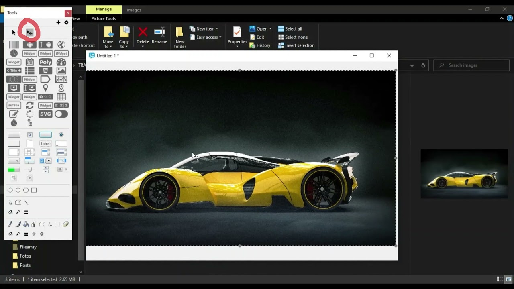

# frlDragDropFilesIntoIDE

Este plugin le permite arrastrar archivos de imagen, video, SVG y textos planos e importarlos a cualquiera de las ventanas abiertas en el IDE de LiveCode.

### README in English [(here)](README.md)

### Ver el [código de conducta](CODIGO_DE_CONDUCTA.md)

## Autor:

Desarrollado por [FerrusLogic](https://ferruslogic.com)

## Licencia:

frlDragDropFilesIntoIDE se distribuye bajo la [licencia MIT](LICENSE).

## Versión actual: 1.1.0

## Instalación

Para instalar el plugin use la stack **dragdropFilesIntoIDEInstaller.livecode**. La misma copiará la extensión a su carpeta de extensiones de LiveCode.

## Archivos soportados

Los archivos multimedia que se importan serán aquellos que tengan las siguientes extensiones.

### Imagen:

``png,jpeg,jpg,gif,bmp,pbm,pgm,ppm,xbm,xpm,xwd,pict,webp,jfif,tif,tiff,dib,vga,pict,pict2,pic``

### Audio y Video:

``mp3,mp4,mpg,mov,avi,m4a,midi,midi,snd,aac,wma,ogg,mpeg,m2v,mpeg2,qt,ram,rm``

### SVG:

``svg``

### Texto Plano:

``txt,lng,locale,log,mnu,nfo,inf,ini,inc,bar,cfg,sav,conf,manifest,lst,ion,rc,properties,mf,list,wbt,lic,css,hs,iss,js,nsi,nsh,java,php,php3,php4,php5,tct,xml,xsml,xsl,kml,adr,sfx,,sh,bsh,lua,pl,pm,py,as,las,mx,vb,f,for,f90,f95,f2k,tex,mak,tpl,asm,plx,lsp,lisp,scm,smd,ss,kix,au3,ml,mli,sml,thy,ada,ads,adb,v,lhs,cmake,twig,yml``

### Pilas

Además de los archivos multimedia también tendremos la posibilidad de arrastrar cualquier pila binaria o de solo código a nuestro IDE para abrirla.

 ``livecode,livecodescript,rev,mc``

### Extensión para LiveCode

También podemos instalar las extensiones a nuestro LiveCode solo arrastrándola a cualquier stack.

``lce``

### Remplaza una multimedia por otra.

Para actualizar el contenido de un objeto multimedia en nuestro IDE. Presionamos las teclas de Alt + Shift en Windows y Option + shift en Mac OS. Luego arrastramos y soltamos el archivo sobre el objeto. Por lo que si tenemos una imagen en nuestra pila presionamos las teclas según nuestro sistema operativo y soltamos el archivo de la nueva imagen sin soltar las teclas y se remplazara el contenido de la imagen.

En el caso de las imágenes por defecto se empotrarán en la stack. Pero si queremos que sean imágenes referenciadas, mantenemos presionadas las teclas Ctrl + Shif.